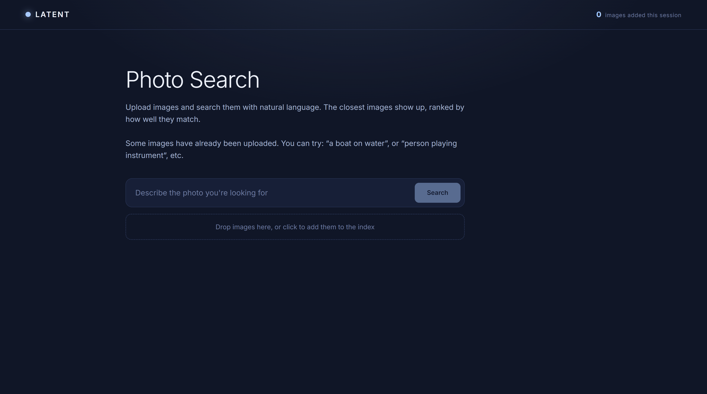
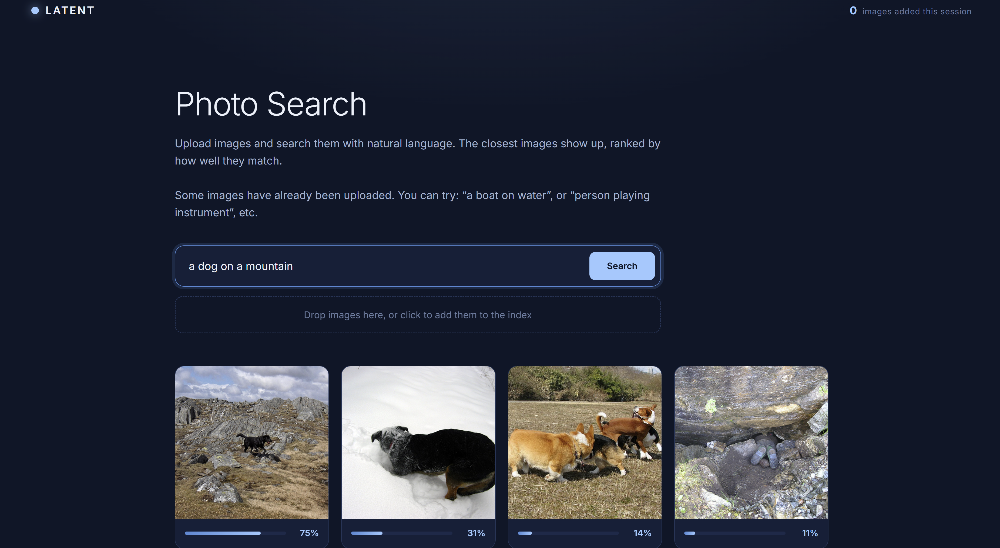

# Semantic Photo Search

A semantic image retrieval system that allows users to search images using natural-language descriptions. This project combines CLIP embeddings, FAISS vector search, and a two-stage retrieval pipeline with reranking to return the most similar images to a text query.

## Features
* Natural-language image search using CLIP embeddings
* Fast vector retrieval with FAISS
* Two-stage retrieval pipeline:
  * Candidate generation using CLIP similarity
  * Learned reranking for refined ranking
* React frontend for image upload and search
* FastAPI backend for indexing and retrieval
* Evaluation framework using Recall@K, MRR, and nDCG
* Drag-and-drop image uploads

## Demo



Example queries:

* "a boat on water"
* "person playing instrument"
* "a dog on a mountain"
* "a person sleeping"

The system retrieves the top 6 semantically similar images, even when the exact words do not appear in filenames.

### Example Search



## Architecture

The system uses a two-stage retrieval pipeline:

```text
User Query
     │
     ▼
CLIP Text Encoder
     │
     ▼
FAISS Vector Search
     │
     ▼
Top-100 Candidates
     │
     ▼
Confidence Estimation
(Margin-Based Gating)
     │
     ├── High Confidence → Return CLIP Ranking
     │
     └── Low Confidence
              │
              ▼
      Logistic Reranker
              │
              ▼
      Final Ranked Results
```

### Stage 1: CLIP Retrieval

Images and text are embedded into a shared semantic space using CLIP. Candidate images are retrieved using cosine similarity and FAISS approximate nearest-neighbor search.

### Stage 2: Learned Reranking

A logistic regression reranker is trained on Flickr30k image-caption pairs using:

* Cosine similarity
* Embedding differences
* Elementwise embedding interactions

The reranker predicts the probability that a query-image pair is a semantic match.

### Confidence-Gated Inference

Experiments showed that always reranking degraded retrieval quality on Flickr30k. To address this, a confidence-based gating mechanism was implemented that only applies reranking when CLIP's top candidates are ambiguous.

This preserves strong CLIP performance while selectively applying additional computation when retrieval confidence is low.

## Evaluation

Retrieval quality was evaluated on held-out Flickr30k image-caption pairs using:

* Recall@1
* Recall@5
* Recall@10
* Mean Reciprocal Rank (MRR)
* nDCG@10
### Evaluation Metrics

Retrieval quality is measured using several standard information-retrieval metrics.

#### Recall@K

Measures whether the correct image appears within the top K retrieved results.

For example:

* Recall@1 = percentage of queries where the correct image is ranked first.
* Recall@5 = percentage of queries where the correct image appears in the top 5 results.
* Recall@10 = percentage of queries where the correct image appears in the top 10 results.

Higher values indicate better retrieval performance.

#### Mean Reciprocal Rank (MRR)

Measures how highly the correct image is ranked on average.

For a query:

```text
Rank 1 → 1.0
Rank 2 → 0.5
Rank 3 → 0.33
Rank 10 → 0.10
```

MRR averages these reciprocal ranks across all queries.

Higher MRR indicates that relevant images tend to appear closer to the top of the results list.

#### nDCG@10 (Normalized Discounted Cumulative Gain)

Measures ranking quality while giving more credit to results appearing near the top of the list.

Correct images ranked near position 1 contribute more than correct images ranked near position 10.

nDCG values range from 0 to 1:

* 1.0 = ideal ranking
* 0.0 = poor ranking

This metric is commonly used in search and recommendation systems because it rewards placing relevant items as early as possible.

---

## Running the Project

### 1. Clone the Repository

```bash
git clone https://github.com/sophiewang-mit/semantic_photo_search.git
cd semantic_photo_search
```

### 2. Backend Setup

```bash
cd backend

python -m venv venv

# Windows
venv\Scripts\activate

pip install -r requirements.txt
```

Start the backend:

```bash
uvicorn app.main:app --reload
```

The FastAPI server will be available at:

```text
http://localhost:8000
```

### 3. Frontend Setup

Open a second terminal:

```bash
cd frontend

npm install
npm run dev
```

The React application will be available at:

```text
http://localhost:5173
```

### 4. Search Demo Images

The backend automatically indexes images stored in:

```text
backend/demo_images/
```

on startup.

Users can immediately search the provided demo images without uploading any files.

### 5. Upload New Images

Users may upload additional images through the web interface.

Uploaded images are:

1. Saved locally
2. Embedded using CLIP
3. Added to the FAISS index
4. Made immediately searchable

---

## Next Steps

### Cross-Encoder Reranking

Replace the current feature-based logistic reranker with a neural cross-encoder capable of jointly modeling image-text interactions.

This would allow the reranker to capture semantic relationships that are not preserved in CLIP embeddings alone.


### User Experience Improvements

* Saved search history
* Batch image uploads
* Image deletion and re-indexing
* Retrieval explanations and confidence visualization
* Mobile-responsive interface


### Test Set Results

| Metric    | CLIP   | Always Rerank | Confidence-Gated |
| --------- | ------ | ------------- | ---------------- |
| Recall@1  | 90.4%  | 88.0%         | 90.4%            |
| Recall@5  | 98.8%  | 98.8%         | 98.8%            |
| Recall@10 | 100.0% | 100.0%        | 100.0%           |
| MRR       | 94.2%  | 93.1%         | 94.2%            |
| nDCG@10   | 99.7%  | 98.9%         | 99.7%            |

These results demonstrate that CLIP is already highly effective on Flickr30k retrieval, while the confidence-gated reranking framework provides a mechanism for selectively applying additional ranking models without degrading baseline performance.

